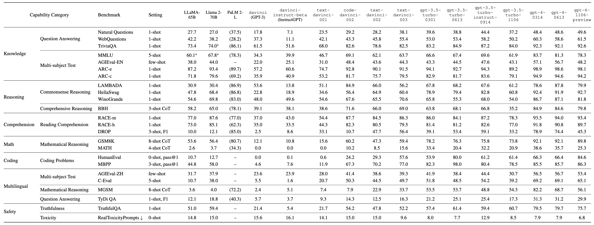
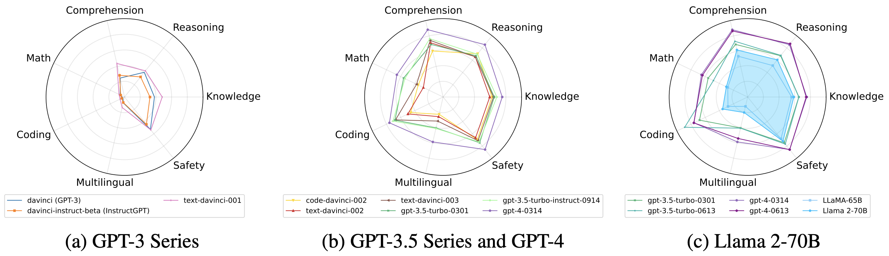

# GPT-Fathom: Evaluating LLMs under Aligned Settings

<div align="center">


"Minecraft scenario: an engineer standing at the edge of a boat, holding a rope to *fathom* the depth of water."<br>
(image generated by Midjourney V5.2)

----

By [Shen Zheng](https://github.com/shenz2-2000)<sup>\*</sup>, [Yuyu Zhang](https://sites.google.com/site/yuyuzhang90)<sup>\*</sup>, [Yijie Zhu](https://github.com/zhuyijie), [Chenguang Xi](http://xichenguang.com), [Pengyang Gao](https://twitter.com/fuergaosi),<br>
Xun Zhou, Kevin Chen-Chuan Chang

From ByteDance, University of Illinois at Urbana-Champaign

[📃 Paper](https://arxiv.org/abs/2309.16583) | [🐦 Twitter](https://twitter.com/shen_zheng25741/status/1711608646654673242)


</div>

Recently, with the rapid progress of large language models (LLMs), more and more LLMs (both open-source and closed-source) are making their debut. There's a burgeoning demand for building an open, systematic, rigorous and reproducible evaluation suite to assess and track their capabilities and limitations. Although there already exist many LLM leaderboards, some key limitations are yet to be addressed (discussed in details [here](#motivation)). For example, existing LLM leaderboards often reference scores reported in other papers without consistent settings and prompts, which may inadvertently encourage cherry-picking favored settings and prompts for better results.

To dispel the mist among LLM evaluations, we introduce GPT-Fathom, an open-source and reproducible LLM evaluation suite built on top of [OpenAI Evals](https://github.com/openai/evals). We systematically evaluate 10+ leading LLMs as well as OpenAI's legacy models on 20+ curated benchmarks across 7 capability categories, all under aligned settings. GPT-Fathom serves as a standard gauge to pinpoint the position of emerging LLMs, aiming to help the community measure and bridge the gap with leading LLMs. We also explore the impacts of model sensitivity on evaluation results with extensive experiments of various settings.

Our retrospective study on OpenAI's earlier models, including `davinci` ([GPT-3](https://arxiv.org/abs/2005.14165)), `davinci-instruct-beta` ([InstructGPT](https://arxiv.org/abs/2203.02155)), `text-davinci-001`, `code-davinci-002`, `text-davinci-002` and `text-davinci-003`, offers valuable insights into the evolutionary path from GPT-3 to GPT-4. Our work is time-sensitive due to the scheduled deprecation of those legacy models [announced by OpenAI](https://openai.com/blog/gpt-4-api-general-availability).

Currently, the community is eager to know how GPT-3 progressively improves to GPT-4, including technical details like whether adding code data improves LLM's reasoning capability, which aspects of LLM capability can be improved by SFT and RLHF, how much is the alignment tax, etc. Our analysis sheds light on many of these questions, aiming to improve the transparency of advanced LLMs.

## 📖 Table of Contents
- [📊 Leaderboard](#leaderboard)
- [🔍 Analysis and Insights](#analysis-and-insights)
- [☕ Quick Start](#quick-start)
- [💡 FAQs](#faqs)
- [📍 Roadmap](#roadmap)
- [🤝 Acknowledgements](#acknowledgements)
- [📝 Citation](#citation)


<a name="leaderboard"></a>
## 📊 Leaderboard
Main evaluation results of GPT-Fathom.



Note that GPT-Fathom supports various settings for evaluation. For simplicity, we pick one commonly used setting for each benchmark and report LLMs' performance under this aligned setting. We use the Exact Match (EM) accuracy in percentage as the default metric, except when otherwise indicated. For clarity, we also report the number of "shots" used in prompts and whether [CoT](https://openreview.net/forum?id=_VjQlMeSB_J) prompting is used. For the [AGIEval](https://github.com/microsoft/AGIEval) benchmark, we use the official few-shot (3-5 shots) setting. For PaLM 2-L, since its API access is not currently available yet, we instead cite the numbers from [PaLM 2](https://arxiv.org/abs/2305.10403). Numbers that are not from our own experiments are shown in brackets. Numbers with \* are obtained from optimized prompts.

According to the table above, we plot radar charts to visualize the capabilities of evaluated LLMs.



For Claude 2, we're still on the waitlist of API access, so we evaluate OpenAI's latest models (including Web-version GPT-3.5 and GPT-4, evaluated in 2023/09) under the same settings used by [Claude 2](https://www-files.anthropic.com/production/images/Model-Card-Claude-2.pdf).


<a name="analysis-and-insights"></a>
## 🔍 Analysis and Insights

### History of OpenAI models
We evaluate 10+ OpenAI models, which have been actively evolving since GPT-3 was released in 2020. To tease out the relationships between these models, we illustrate OpenAI's evolutionary path from GPT-3 to GPT-4 in the following figure. We omit deprecated legacy models such as `code-davinci-001` and only list the models evaluated in GPT-Fathom.


**Caveat:** 
As claimed in OpenAI's [model index](https://platform.openai.com/docs/model-index-for-researchers), their models generally used the best available datasets at the time of training. As a result, our analysis on OpenAI's models may not serve as a rigorous ablation study.

### Impacts of SFT / RLHF on LLM capabilities

**SFT**
  - `davinci` (GPT-3) + SFT -> `text-davinci-001`: SFT significantly improves performance on most benchmarks.
  - `code-davinci-002` + SFT -> `text-davinci-002`: SFT on stronger base model shows the opposite effect, which underperforms the base model on most benchmarks (except for coding tasks, which is further discussed below).
  - A similar trend is observed on open-source models: SFT boosts the performance of LLaMA-65B on MMLU (refer to reported performance of SFT model LLaMA-I in the original [paper]((https://arxiv.org/abs/2302.13971))), however, all SFT models on top of Llama2-70B in [Open LLM Leaderboard](https://huggingface.co/spaces/HuggingFaceH4/open_llm_leaderboard) show only marginal improvements on MMLU.

**RLHF**
  - `text-davinci-002` + [PPO](https://arxiv.org/abs/1707.06347) -> `text-davinci-003`: RLHF model has comparable or slightly worse performance on most benchmarks compared to the base model `code-davinci-002` (except for coding tasks).
  - A similar trend is observed on open-source models: the official RLHF version of Llama2-70B performs slightly worse than its base model on MMLU, HellaSwag and ARC-c, as reported in [Open LLM Leaderboard](https://huggingface.co/spaces/HuggingFaceH4/open_llm_leaderboard).

**SFT / RLHF impacts on coding capabilities**


- SFT and RLHF models excel in pass@1, compared to the base model, while slightly underperforms in pass@100.
- We interpret these intriguing results as follows:
  - pass@100 gauges intrinsic ability to solve a coding problem, while pass@1 emphasizes the one-take bug-free coding capability.
  - SFT and RLHF models still have to pay the alignment tax, showing a minor performance drop in pass@100, which aligns with their slightly worse performance across other tasks.
  - SFT and RLHF can effectively distill the capability of pass@100 into pass@1, which transfers inherent problem-solving skills to one-take bug-free coding capability.
  - As expected, smaller models like `code-cushman-001` (Codex-12B) and `gpt-3.5-turbo-0301` have limited intrinsic capability in terms of pass@100. However, their pass@1 can be dramatically improved by SFT and RLHF. This is good news for research on low-cost small-size LLMs.
- We observe that state-of-the-art LLMs like GPT-4 can inherently tackle complicated tasks, although sometimes succeed after many sampling trials. We anticipate that LLMs have yet to reach their full potential, since SFT and RLHF can consistently enhance LLMs by translating their intrinsic capabilities into one-take pass rates on reasoning-intensive tasks.

### Impacts of pretraining with code data
- `code-cushman-001` (Codex-12B) represents OpenAI's preliminary effort to train LLMs on code data, which shows decent coding performance despite its modest model size.
- `code-davinci-002`, which is pretrained on a mixture of text and code data, significantly outperforms the previous GPT-3 Series across various tasks. On some reasoning tasks such as LAMBADA and BBH, `code-davinci-002` even beats the latest `gpt-3.5-turbo-0613` model. This suggests that incorporating code data into LLM pretraining could universally elevate its potential, particularly in the capability of reasoning.

### Seesaw phenomenon of LLM capabilities
- We observe a so-called "seesaw phenomenon" by comparing the OpenAI API models dated in 2023/03 and 2023/06, where certain capabilities exhibit improvement, while a few other capabilities clearly regress.
- For instance, compared to `gpt-3.5-turbo-0301`, the upgraded model `gpt-3.5-turbo-0613` excels on HumanEval (53.9 -> 80.0) but dramatically degrades on MATH (32.0 -> 15.0). `gpt-4-0613` outperforms `gpt-4-0314` on DROP (78.7 -> 87.2) but plummets on MGSM (82.2 -> 68.7). OpenAI also [admits]((https://openai.com/blog/function-calling-and-other-api-updates)) that when they release a new model, while the majority of metrics have improved, there may be some tasks where the performance gets worse.
- The seesaw phenomenon presents a universal challenge that may obstruct LLM's path towards AGI, which necessitates a model that excels across all types of tasks. We strongly encourage the research community to pay more attention to this challenge.

### OpenAI vs. Non-OpenAI LLM Performance
- PaLM 2-L clearly outperforms `gpt-3.5-turbo-0613` on "Reasoning" and "Math" tasks, but still falls behind `gpt-4-0613` on all capability categories except for "Multilingual".
- Claude 2 stands as the leading non-OpenAI model, which achieves comparable or slightly worse performance on a variety of benchmarks, compared to latest OpenAI models.

### Closed-source vs. open-source LLMs
- Llama 2-70B outperforms LLaMA-65B on most benchmarks, especially on "Reasoning" and "Comprehension" tasks.
- Llama 2-70B surpasses `gpt-3.5-turbo-0613` on "Comprehension" tasks, but still underperforms on other capability dimensions, especially "Math", "Coding" and "Multilingual". We strongly encourage the open-source community to improve these capabilities of open-source LLMs.

### OpenAI API-based vs. Web-version LLMs
- The dated API models `gpt-3.5-turbo-0613` and `gpt-4-0613` consistently perform slightly better than their front-end counterparts, i.e., Web-version GPT-3.5 (serving ChatGPT) and Web-version GPT-4.
- The latest GPT-4 Advanced Data Analysis (previously known as Code Interpreter) boosts the coding performance, which achieves a striking 85.2 pass@1 score on HumanEval.

### Impacts of model sensitivity

**Prompt sensitivity**
- Open-source models like LLaMA-65B and Llama 2-70B are prompt-sensitive. For instance, a minor tweak of the prompt template results in a significant drop of Llama 2-70B's score on TriviaQA (74.0 -> 55.5).
- OpenAI's leading models are fairly robust against alteration of prompts (without changing the inherent meaning).

**CoT prompting**
- The influence of CoT prompting varies across benchmarks.
- On tasks that are knowledge-intensive, like MMLU, CoT has minimal or even slightly negative impact on performance. However, for reasoning-intensive tasks, such as BBH and GSM8K, CoT prompting markedly enhances LLM performance. For instance, on the GSM8K with 8-shot examples, `gpt-4-0314` dramatically boosts its score when CoT prompting is employed (45.7 -> 92.1).

**Number of "shots"**
- Benchmark performance generally improves with an increased number of "shots", however, the improvement rate quickly shrinks beyond 1-shot, particularly for stronger models.
- For instance, `gpt-4-0314` achieves 94.9 on ARC-c with 1-shot example, and only marginally increases to 95.6 with 25-shot examples. This indicates that 1-shot example typically works well for most tasks, which aligns with our primary evaluation setting.

**Sampling variance**
- LLMs (especially base models) tend to underperform with a higher temperature $T$. On coding benchmarks, although a higher temperature $T$ still hurts pass@1, it boosts pass@100 due to higher coverage of the decoding space with more randomness.
- The nucleus sampling parameter $\text{top}_p$ has marginal influence on the performance of fine-tuned LLMs. A similar exception is observed on coding benchmarks, where a higher $\text{top}_p$ diminishes pass@1 but largely enhances pass@100.


<a name="quick-start"></a>
## ☕ Quick Start

### Install
- Ensure you have Python version >= 3.9 installed.
- Clone this repository to your local machine.
- Install the necessary requirements using:
```sh
pip install -e .
```

### Run evaluations
Supported models and evaluation tasks:
- Following [OpenAI Evals](https://github.com/openai/evals), `completion function` is the generalization of model completion, where a "completion" is some text output that would be answer to the prompt. An `eval` is a task used to evaluate the LLM performance.
- We support models listed in [OpenAI API](https://platform.openai.com/docs/models/), [Azure OpenAI Service](https://learn.microsoft.com/en-us/azure/ai-services/openai/concepts/models), [LLaMA and Llama 2](https://github.com/yuyuz/GPT-Fathom/blob/main/evals/registry/completion_fns/llama.yaml) as the `completion function` for evaluation.
- We support evaluation tasks as `evals` registered under [`evals/registry/evals`](evals/registry/evals).

We offer two command-line interfaces:
- `oaieval` for running a single evaluation.
- `oaievalset` for running a set of evaluations.

To evaluate models in [OpenAI API](https://platform.openai.com/docs/models/), first set your API key as an environment variable: ```OPENAI_API_KEY="YOURKEY"```. Then specify the `completion function` and the `eval` to run evaluation, for example:
```sh
oaieval gpt-3.5-turbo gsm8k-8shotCoT
```
**Notes**
- To evaluate models in [Azure OpenAI Service](https://learn.microsoft.com/en-us/azure/ai-services/openai/concepts/models), make sure you first deploy the model following [Azure Deploy](https://learn.microsoft.com/en-us/azure/ai-services/openai/how-to/create-resource?pivots=web-portal) to get a `deployment id`. Then specify a `completion function` name to bind with your `deployment id` in [`evals/completion_fns/openai.py`](https://github.com/yuyuz/GPT-Fathom/blob/fcb21e048aa4a68f5f66fa9079438c465d0d826b/evals/completion_fns/openai.py#L166), and specify your `api_key` and `api_base` in [`evals/utils/azure_utils.py`](/evals/utils/azure_utils.py). Run evaluation with flag `--azure_eval True`, for example:
```sh
oaieval text-davinci-001 gsm8k-8shotCoT --azure_eval True
```
- To evaluate a model from LLaMA or Llama 2 family, first configure the model following the official HuggingFace documents for [LLaMA](https://huggingface.co/docs/transformers/main/model_doc/llama) and [Llama 2](https://huggingface.co/docs/transformers/main/model_doc/llama2). Then run evaluation with flag `--eval_in_batch True`, for example:
```sh
oaieval llama gsm8k-8shotCoT --eval_in_batch True
```

For more one-line quick evaluations, refer to [`quick-evals.md`](docs/quick-evals.md).

Further details on `oaieval` and `oaievalset` are discussed in [`run-evals.md`](docs/run-evals.md).

### Customize settings
We support evaluations with customized settings, including sampling temperature, prompt format, number of shots, and maximum tokens. Learn how in [`custom-eval.md`](docs/custom-eval.md).

### Evaluate new LLMs
GPT-Fathom supports evaluation of new LLMs in two ways:

1. Calling API: `completion function` is called in multi-thread fashion, which returns a response for a single sample each time.
2. Inferencing HuggingFace models: `completion function` is called to generate responses to multiple samples in batch mode.

To learn how to evaluate new models, refer to [`completion-fns.md`](docs/completion-fns.md).

<a name="faqs"></a>
## 💡 FAQs

### Why our results differ from the officially reported scores?
For fair comparison, we evaluate LLMs under aligned settings such as the number of "shots", whether CoT prompting is used, and sampling hyperparameters (e.g., temperature and top<sub>p</sub>). We report the results from our own experiments, instead of arbitrarily citing numbers from papers. Therefore, our evaluation setting of a LLM may differ from its official paper, which leads to different results. For example, on HumanEval, [LLaMA](https://arxiv.org/abs/2302.13971) and [Llama 2](https://arxiv.org/abs/2307.09288) use a temperature of 0.1 for pass@1 scores and 0.8 for pass@100 scores, while we consistently use 0.8 for all the coding benchmark evaluations.

Moreover, even under the same setting, other factors such as the prompt template, answer parsing / matching details and sampling variance can still affect the evaluation results. Note that most of the released LLMs do not fully disclose these details. In our [paper](https://arxiv.org/abs/2309.16583), we investigate the impacts of model sensitivity on evaluation results with extensive experiments.

### How to rank LLMs in GPT-Fathom?
Unfortunately, GPT-Fathom is not designed for ranking LLMs. Although it's simple to calculate (weighted) average over individual benchmark scores and arbitrarily define some "overall score" for ranking LLMs, we believe that any pre-defined ranking criteria may encourage "overfitting" and chasing a higher ranking on the leaderboard, whether intentionally or not.

In our opinion, benchmark scores should serve as a "sanity check" on every aspect of LLM capabilities, and we take achieving good benchmark scores as a necessary but not sufficient condition for being a decent LLM. Looking back on the history of OpenAI's GPT series, while many contemporary models of BERT series are obsessed with "overfitting" numerous NLP leaderboards, it becomes clear that it's crucial to focus on improving the general, task-agnostic, few-shot model performance of LLMs.

<a name="motivation"></a>
### There already exist many LLM leaderboards. Why reinvent the wheel?
Existing LLM leaderboards and evaluations suites present some, if not all, of the following limitations.

* **Inconsistent settings:** <br>
The evaluation settings, such as the number of in-context example "shots", whether [CoT](https://openreview.net/forum?id=_VjQlMeSB_J) prompting is used, methods of answer parsing and metric computation, etc., often differ across existing LLM works. Moreover, most of the released LLMs do not disclose their prompts used for evaluation, making it difficult to reproduce the reported scores. Different settings and prompts may lead to very different evaluation results, which may easily skew the observations. Yet, many existing LLM leaderboards reference scores from other papers without consistent settings and prompts, which may inadvertently encourage cherry-picking favored settings and prompts for better results. To achieve reliable conclusions, it is crucial to make apples-to-apples LLM comparisons with consistent settings and prompts.

* **Incomplete collection of models and tasks:** <br>
For the moment, when compared to OpenAI's leading models such as GPT-4, all the other LLMs (particularly open-source models) exhibit a substantial performance gap. In fact, it takes OpenAI nearly three years to evolve from GPT-3 (released in 2020/06) to GPT-4 (released in 2023/03). Existing LLM leaderboards primarily focus on the latest models, while missing a retrospective study on OpenAI's earlier models and its mysterious path from GPT-3 to GPT-4. Besides the coverage of models, many existing works assess LLMs on merely one or a few aspects of capabilities, which is not sufficient to provide a comprehensive view to deeply understand the strength and weakness of the evaluated LLMs.

* **Insufficient study on model sensitivity:** <br>
LLMs are known to be sensitive to the evaluation setting and the formatting of prompt. However, many existing works only focus on the benchmark score under one specific setting, while overlooking the impacts of model sensitivity on the overall usability of LLMs. In fact, it is unacceptable that a slightly rephrased prompt could cause the LLM to fail in responding it correctly. Due to the lack of systematic study on model sensitivity, this potential vulnerability in LLMs remains not well understood.

The challenges above hinder a comprehensive understanding of LLMs, and highlight the pressing need for building a systematic, consistent and reproducible LLM evaluation suite.

### How is GPT-Fathom different from other evaluation suites?
GPT-Fathom mainly focuses on unveiling OpenAI's somewhat mysterious path from GPT-3 to GPT-4, by systematically evaluating both latest and earlier models from OpenAI. Here we compare with other popular evaluation suites to highlight the difference.
* [HELM](https://crfm.stanford.edu/helm/latest/) evaluates numerous models on a wide range of benchmarks. However, it primarily uses answer-only prompting (without CoT) and has not included the latest leading models such as GPT-4, Claude 2 and PaLM 2 (as of the released date of GPT-Fathom in 2023/09).
* [Open LLM Leaderboard](https://huggingface.co/spaces/HuggingFaceH4/open_llm_leaderboard) focuses on open-source LLMs, while we jointly consider leading closed-source and open-source LLMs. In fact, by providing reproducible evaluation results of leading closed-source LLMs, we aim to help the open-source LLM community measure and bridge the performance gap.
* [OpenCompass](https://github.com/open-compass/opencompass) evaluates latest open-source and closed-source LLMs (all released after 2023/03) on a variety of benchmarks, while we cover both leading LLMs and OpenAI's earlier models to better understand the evolutionary path from GPT-3 to GPT-4.
* [InstructEval](https://declare-lab.net/instruct-eval/) is designed for evaluating instruction-tuned LLMs, while we evaluate both base and SFT / RLHF models to seek insights for community-concerned questions, e.g., what's the impact of SFT / RLHF on each aspect of capability of LLMs.
* [AlpacaEval](https://tatsu-lab.github.io/alpaca_eval/) evaluates on simple instruction-following tasks as a quick and cheap proxy of human evaluation, while we provide systematic evaluation of various aspects of LLM capabilities.
* [Chatbot Arena](https://lmsys.org/blog/2023-05-03-arena/) evaluates human user's dialog preference with a Elo rating system, while we focus on automatic evaluation over popular benchmarks.
* [Chain-of-Thought Hub](https://github.com/FranxYao/chain-of-thought-hub) focuses on evaluating the reasoning capability of LLMs with CoT prompting, while we support both CoT and answer-only prompting settings and evaluate various aspects of LLM capabilities.

### For multiple-choice questions, use black-box or white-box evaluation?
To avoid confusion, we first describe how black-box / white-box evaluation works for multiple-choice questions.

* Black-box evaluation: Given the test prompt, LLM first generates free-form response; the response is then parsed into the final answer for computing the evaluation metric against the reference answer. For multiple-choice questions, the reference answer is typically the letter of the correct option such as `(A)`, `(B)`, `(C)` or `(D)`.
* White-box evaluation: Given the test prompt, LLM generates per-token likelihood for each option; the per-token likelihood is then normalized for length (and optionally normalized by answer context as described in [GPT-3](https://arxiv.org/abs/2005.14165)). The option with the maximum normalized likelihood is then picked as the predicted option.

GPT-Fathom adopts the black-box method throughout all evaluations, since 1) the per-token likelihood for input prompt is usually not provided by closed-source LLMs; 2) the white-box method manually restricts the prediction space, thus the evaluation result would be no worse than random guess in expectation; while for the black-box method, a model with inferior capability of instruction following may get 0 score since the output space is purely free-form. In our opinion, instruction following is such an important LLM capability and should be taken into consideration in evaluation.

To reduce the variance of black-box evaluation on base models, which typically have weaker capability of instruction following due to lack of fine-tuning, GPT-Fathom uses 1-shot setting by default for most tasks. With just 1-shot example of question and answer, we observe that stronger base models are able to perform in-context learning to follow the required output format for multiple-choice questions.


<a name="roadmap"></a>
## 📍 Roadmap
- [ ] More evaluation benchmarks
  - [ ] Support translation benchmark [Flores](https://github.com/facebookresearch/flores/blob/main/flores200/README.md)
  - [ ] Support multi-subject test benchmark [SciBench](https://github.com/mandyyyyii/scibench)
  - [ ] Support mathematical reasoning benchmark [TheoremQA](https://github.com/wenhuchen/TheoremQA)
  - [ ] Support model-graded benchmarks, such as [MT-Bench](https://github.com/lm-sys/FastChat/tree/main/fastchat/llm_judge)
- [ ] More capability dimensions
  - [ ] Support evaluation of agent capability
  - [ ] Support long-context evaluation
- [ ] More leading LLMs
  - [ ] Support evaluation of `gpt-3.5-turbo-instruct`


<a name="acknowledgements"></a>
## 🤝 Acknowledgements
GPT-Fathom is developed based on [OpenAI Evals](https://github.com/openai/evals).

We refer to the official papers of [GPT-3](https://arxiv.org/abs/2005.14165), [InstructGPT](https://arxiv.org/abs/2203.02155), [Codex](https://arxiv.org/abs/2107.03374), [LLaMA](https://arxiv.org/abs/2302.13971), [Llama 2](https://arxiv.org/abs/2307.09288), [PaLM 2](https://arxiv.org/abs/2305.10403) and [Claude 2](https://www-files.anthropic.com/production/images/Model-Card-Claude-2.pdf) for selecting benchmarks and evaluation settings. We also refer to some prompt implementations from [Chain-of-Thought Hub](https://github.com/FranxYao/chain-of-thought-hub).

We appreciate all the existing work on benchmarking LLMs as a joint force to push forward the LLM community.


<a name="citation"></a>
## 📝 Citation

```bibtex
@misc{zheng2023gptfathom,
      title={{GPT-Fathom}: Benchmarking Large Language Models to Decipher the Evolutionary Path towards {GPT-4} and Beyond}, 
      author={Shen Zheng and Yuyu Zhang and Yijie Zhu and Chenguang Xi and Pengyang Gao and Xun Zhou and Kevin Chen-Chuan Chang},
      year={2023},
      eprint={2309.16583},
      archivePrefix={arXiv},
      primaryClass={cs.CL},
      url={https://arxiv.org/abs/2309.16583}
}
```
Please also cite the original datasets in your paper when you use them. We provide the relevant citations [here](assets/references.bib).
